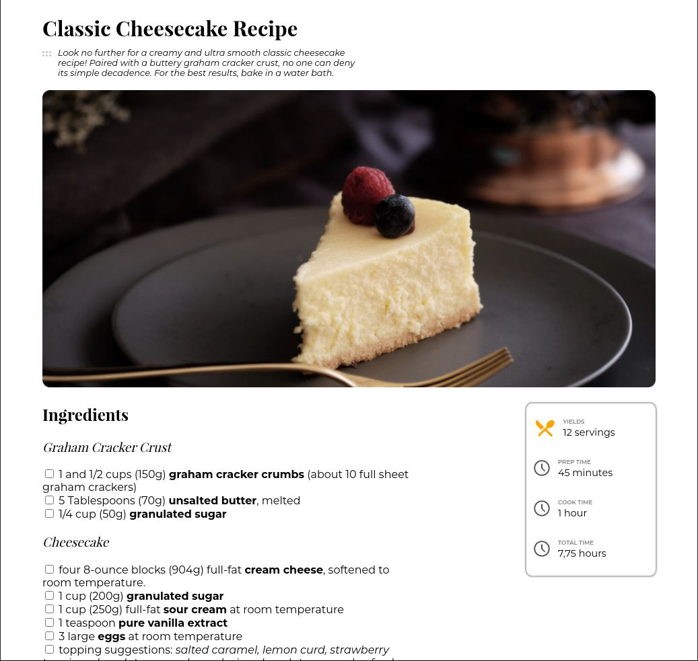

<!-- Please update value in the {}  -->

<h1 align="center">Recipe Page</h1>

   Solution for a challenge from  <a href="http://devchallenges.io" target="_blank">Devchallenges.io</a>.

  <h3>
    <a href="https://coldfix.dev/dev-challenges/recipe-page/recipe.html">
      Demo
    </a>
     | 
    <a href="https://devchallenges.io/challenges/OEKdUZ6xs0h99C38XVht">
      Challenge
    </a>
  </h3>

<!-- TABLE OF CONTENTS -->

## Table of Contents

- [Overview](#overview)
  - [Built With](#built-with)
- [Features](#features)
- [How to use](#how-to-use)
- [Contact](#contact)
- [Acknowledgements](#acknowledgements)

<!-- OVERVIEW -->

## Overview

- Where can I see your demo?

Right [here](https://coldfix.dev/dev-challenges/recipe-page/recipe.html).

- What was your experience?

I thought it was difficult since I had to create a clock svg and a knife
and spoon svg. 

- What have you learned/improved?

I learned how to create SVGs with a text editor.

- Your wisdom? :)

Use Google Material Icons or some library of some SVGs instead of making SVGs
yourself if you can.

### Built With

HTML, CSS, and SVG.

## Features

This application/site was created as a submission to a [DevChallenges](https://devchallenges.io/challenges) challenge. The [challenge](https://devchallenges.io/challenges/TtUjDt19eIHxNQ4n5jps) was to build an application to complete the following user stories:

- [x] User story: I can see a recipe with ingredients and instructions
- [x] User story: I can select a checkbox if I have the ingredients
- [x] User story: I can see the number of servings, baking times

## Acknowledgements

- [The SVG `path` Syntax: An Illustrated Guide](https://css-tricks.com/svg-path-syntax-illustrated-guide/)

## Contact

- Website [coldfix.dev](https://coldfix.dev)
- GitHub [@dXu23-username](https://github.com/dXu23)

